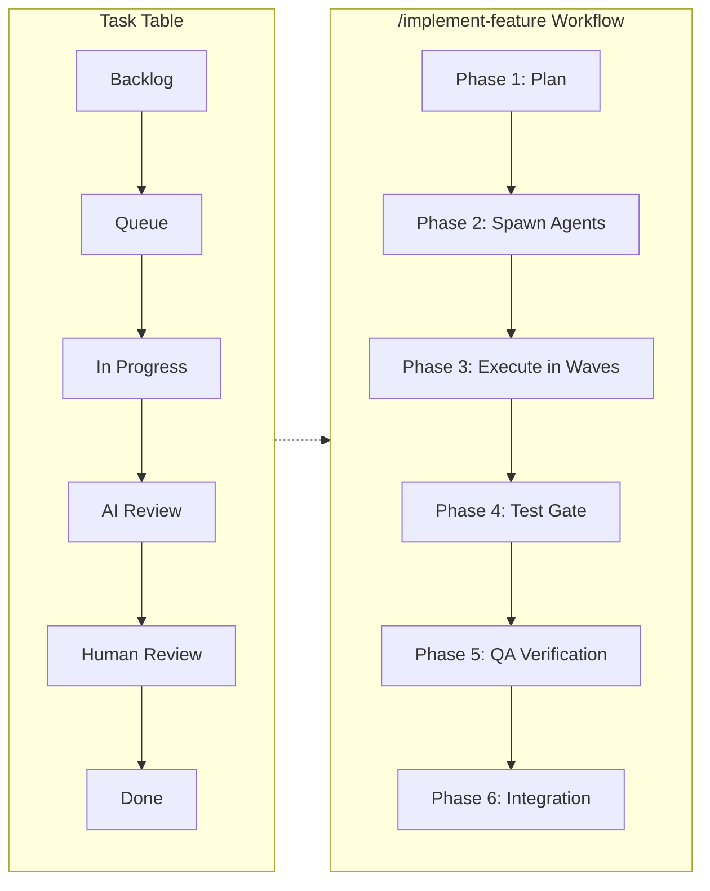
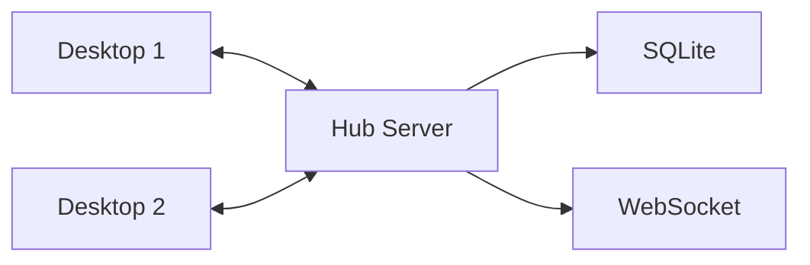

<div align="center">

# Claude UI

### Desktop Command Center for Autonomous AI Agent Teams

[](https://www.electronjs.org/)
[](https://react.dev/)
[](https://www.typescriptlang.org/)
[](LICENSE)

</div>

---

## What is Claude UI?

Claude UI is a desktop application for orchestrating fleets of autonomous Claude coding agents. It provides a unified interface to spawn, monitor, and coordinate AI agents across multiple projects — with workflow-driven task boards, integrated terminals, git workflows, and productivity tools.

**User Story**: *"As a developer managing multiple codebases, I want to delegate tasks to AI agents and track their progress visually, so I can ship features faster while maintaining oversight of what's being built."*

---

## Architecture

<div align="center">
  <picture>
    <source media="(prefers-color-scheme: dark)" srcset="docs/images/architecture.svg">
    <source media="(prefers-color-scheme: light)" srcset="docs/images/architecture.svg">
    
  </picture>
</div>

<details>
<summary><strong>Architecture Overview</strong></summary>

| Layer | Components | Technology |
|-------|------------|------------|
| **Renderer** | React Components, TanStack Router, React Query, Zustand | React 19, TypeScript |
| **Preload Bridge** | Typed IPC Context, window.api | Electron contextBridge |
| **Main Process** | IPC Router, 29 Services, OAuth, MCP Servers, PTY | Node.js, Electron 39 |
| **External** | Hub Server, GitHub/Spotify/Calendar APIs, Anthropic SDK | REST, WebSocket, OAuth2 |
| **Storage** | SQLite (Hub), JSON Files (Local), Task Specs | File system, SQLite |

**Data Flow**: React Query hooks call `ipc()` → Preload bridge → IPC Router → Services → External APIs/Storage

</details>

---

## Features

### Agent & Workflow Management

| Feature | Description |
|---------|-------------|
| **Agent Orchestration** | Spawn, pause, resume, and terminate multiple Claude CLI agents simultaneously |
| **Workflow-Driven Task Table** | Sortable, filterable task table with customizable agent workflows and `/implement-feature` skill integration |
| **Agent Queue** | Queue tasks for sequential agent execution with dependency management |
| **Progress Watching** | Real-time sync of `docs/progress/*.md` files to Hub for crash-safe tracking |
| **Task Launcher** | Launch Claude CLI sessions directly from task rows with project context |

### Project & Workspace Management

| Feature | Description |
|---------|-------------|
| **Multi-Project Support** | Manage multiple codebases with instant project switching |
| **Workspaces** | Group related projects with shared settings, max concurrency limits, and device assignment |
| **Device Sync** | Multi-device support via Hub — workspaces can be hosted on specific devices |
| **Git Worktrees** | Parallel development with visual worktree management |
| **Branch Merging** | Visual conflict resolution and merge preview |

### Productivity & Integrations

| Feature | Description |
|---------|-------------|
| **Integrated Terminals** | Multi-pane terminal grid (xterm.js + node-pty) |
| **Daily Planner** | Time blocking with drag-and-drop scheduling |
| **Daily Briefing** | AI-generated summaries and task suggestions |
| **Notes & Ideas** | Quick capture with tags and pinning |
| **Spotify Controls** | Music playback without leaving the app |
| **Google Calendar** | View and create calendar events |
| **GitHub Integration** | PRs, issues, and repo management |
| **Slack/Discord** | MCP-powered communication tools |

### AI & Automation

| Feature | Description |
|---------|-------------|
| **Persistent Assistant** | Built-in Claude assistant with conversation history (Anthropic SDK) |
| **Smart Task Creation** | Natural language task decomposition |
| **Chrono Time Parser** | Parse "tomorrow at 3pm" into timestamps |
| **Voice Interface** | Speech-to-text input and text-to-speech output |
| **Screen Capture** | Quick screenshots for context sharing |
| **Email Integration** | SMTP-based notifications |
| **Notification Watchers** | Background monitoring for Slack/GitHub updates |

---

## Workflow-Driven Task Table

The Task Table provides sortable, filterable task management with customizable agent workflows:



**How It Works**:
1. Create a task in the Task Table with requirements and priority
2. Launch `/implement-feature` skill from the task row actions
3. Agents are spawned in waves (Schema → Service → IPC → Components)
4. **Mandatory test suite** runs before any work is claimed complete
5. Progress syncs to `docs/progress/*.md` for crash recovery
6. QA agents verify each component before integration

---

## Tech Stack

| Layer | Technology |
|-------|------------|
| Desktop | Electron 39 |
| UI | React 19, TanStack Router 1.95 |
| State | React Query 5, Zustand 5 |
| Styling | Tailwind CSS 4, Radix UI |
| Validation | Zod 4 |
| Terminal | xterm.js 6, @lydell/node-pty |
| Backend | Fastify 5, SQLite (Hub) |
| Testing | Vitest, Playwright |

---

## Quick Start

```bash
git clone https://github.com/ParkerM2/Claude-UI.git
cd Claude-UI
npm install
npm run dev
```

| Command | Description |
|---------|-------------|
| `npm run dev` | Start development mode |
| `npm run build` | Production build |
| `npm run lint` | ESLint check |
| `npm run typecheck` | TypeScript check |
| `npm run test` | Run test suite |

---

## Project Structure

```
src/
├── main/           # Electron main process (29 services)
├── preload/        # IPC context bridge
├── renderer/       # React app (25 features)
└── shared/         # Types + IPC contract (single source of truth)

hub/                # Optional sync server (Fastify + SQLite)
.claude/agents/     # 27 specialist agent definitions
```

---

## Hub Server (Optional)

Multi-device sync and real-time collaboration:



```bash
cd hub && npm install && npm run dev
# → http://localhost:3200
```

---

## Stats

| Metric | Value |
|--------|-------|
| TypeScript files | ~300 |
| Feature modules | 25 |
| Main services | 29 |
| IPC handlers | 30 |
| Agent definitions | 27 |
| Color themes | 7 × 2 modes |

---

## License

AGPL-3.0 — see [LICENSE](LICENSE)

<div align="center">

**Built by [Parker](https://github.com/ParkerM2)** · *Powered by Claude*

</div>
