<div align="center">

# ⚡ Claude UI

### The Desktop Command Center for Autonomous AI Agents

[](https://www.electronjs.org/)
[](https://react.dev/)
[](https://www.typescriptlang.org/)
[](https://tailwindcss.com/)
[](LICENSE)

<br />

**Orchestrate fleets of Claude agents. Manage projects. Ship faster.**

A full-featured Electron desktop app for spawning, monitoring, and coordinating autonomous Claude coding agents — with integrated terminals, kanban boards, git workflows, Spotify, calendar, fitness tracking, and more.

<br />


</div>

---

## Table of Contents

- [Why Claude UI?](#why-claude-ui)
- [Features](#features)
- [Architecture](#architecture)
- [Data Flow](#data-flow)
- [Tech Stack](#tech-stack)
- [Getting Started](#getting-started)
- [Project Structure](#project-structure)
- [Theming](#theming)
- [Hub Server](#hub-server)
- [Contributing](#contributing)
- [License](#license)

---

## Why Claude UI?

Running autonomous agents from a terminal is powerful. But when you're juggling **multiple agents across multiple projects**, you need visibility. You need control.

Claude UI gives you:

| Problem | Solution |
|---------|----------|
| Agents running blind in terminals | Real-time dashboard with status, logs, and controls |
| Context-switching between projects | Unified sidebar with instant project switching |
| No visibility into agent work | Kanban boards, task tracking, git diff viewers |
| Manual git workflows | One-click branching, merging, conflict resolution |
| Scattered productivity tools | Built-in calendar, notes, planner, Spotify |

---

## Features

<table>
<tr>
<td width="50%">

### 🤖 Agent Orchestration
- Spawn and monitor multiple Claude agents simultaneously
- Real-time status tracking with execution progress
- Pause, resume, and terminate agent sessions
- Agent-to-agent coordination patterns

### 📋 Project Management
- Drag-and-drop Kanban boards (dnd-kit)
- Task breakdown with subtask tracking
- Milestone and roadmap visualization
- Ideation boards for brainstorming

### 💻 Integrated Terminals
- Multi-pane terminal grid (xterm.js + node-pty)
- Per-project terminal sessions
- Full PTY support with resize handling

</td>
<td width="50%">

### 🔀 Git Workflows
- Branch management and worktree tracking
- Visual merge conflict resolution
- GitHub integration (PRs, issues, repos)
- Changelog generation from commits

### 📊 Analytics & Insights
- Per-project productivity metrics
- Agent performance analytics
- Daily stats and trend visualization

### 🎨 Life & Productivity
- Spotify playback controls & search
- Google Calendar integration
- Daily planner with time blocking
- Notes with tags and pinning
- Fitness tracking (workouts, goals)
- Alert & reminder system

</td>
</tr>
</table>

---

## Architecture

Claude UI follows a strict **three-process Electron architecture** with type-safe IPC as the backbone:


### The IPC Contract — Single Source of Truth

Every piece of data that crosses process boundaries is defined **once** in `src/shared/ipc-contract.ts`:

```mermaid
graph LR
    Contract["📜 ipc-contract.ts<br/>Zod Schemas"]

    Contract -->|"generates types"| Handlers["Main Handlers<br/>Type-safe params"]
    Contract -->|"generates types"| PreloadBridge["Preload Bridge<br/>Type-safe invoke"]
    Contract -->|"generates types"| Hooks["React Query Hooks<br/>Type-safe returns"]

    Handlers -->|"runtime validation"| Zod["Zod.parse()"]

    style Contract fill:#f59e0b,stroke:#f59e0b,color:#000
    style Handlers fill:#10b981,stroke:#10b981,color:#000
    style PreloadBridge fill:#f59e0b,stroke:#f59e0b,color:#000
    style Hooks fill:#61DAFB,stroke:#61DAFB,color:#000
    style Zod fill:#ef4444,stroke:#ef4444,color:#fff
```



> **Zero drift.** Change the contract, and TypeScript errors guide you to every handler, hook, and component that needs updating.

---

## Data Flow

### How a UI Action Becomes a Service Call

```mermaid
sequenceDiagram
    participant User as 👤 User
    participant Component as React Component
    participant Hook as useQuery / useMutation
    participant IPC as ipc() Helper
    participant Bridge as Preload Bridge
    participant Router as IPC Router
    participant Handler as Domain Handler
    participant Service as Service Layer
    participant Store as JSON / File System

    User->>Component: Click / Input
    Component->>Hook: mutate() or query
    Hook->>IPC: ipc('domain.action', params)
    IPC->>Bridge: window.api.invoke(channel, data)
    Bridge->>Router: ipcMain.handle(channel)
    Router->>Handler: Zod validate → dispatch
    Handler->>Service: service.method(params)
    Service->>Store: Read / Write data
    Store-->>Service: Result
    Service-->>Handler: Return value
    Handler-->>Router: Promise.resolve(result)
    Router-->>Bridge: IPC response
    Bridge-->>IPC: Deserialized result
    IPC-->>Hook: Typed response
    Hook-->>Component: Re-render with data
    Component-->>User: Updated UI
```



### Real-Time Event Flow (Agent Updates, Notifications)


### OAuth Token Flow

```mermaid
sequenceDiagram
    participant App as Claude UI
    participant OAuth as OAuth Manager
    participant TokenStore as Token Store<br/>(safeStorage)
    participant Browser as Auth Window<br/>(BrowserWindow)
    participant Provider as OAuth Provider<br/>(GitHub, Google, Spotify)

    App->>OAuth: getAccessToken('spotify')
    OAuth->>TokenStore: loadToken('spotify')

    alt Token exists & valid
        TokenStore-->>OAuth: { accessToken, expiresAt }
        OAuth-->>App: accessToken ✅
    else Token expired
        TokenStore-->>OAuth: { refreshToken }
        OAuth->>Provider: POST /token (refresh_token)
        Provider-->>OAuth: { new_access_token }
        OAuth->>TokenStore: saveToken(encrypted)
        OAuth-->>App: newAccessToken ✅
    else No token
        OAuth->>Browser: Open auth URL
        Browser->>Provider: User authorizes
        Provider-->>Browser: Redirect with code
        Browser->>OAuth: Authorization code
        OAuth->>Provider: POST /token (auth_code)
        Provider-->>OAuth: { access_token, refresh_token }
        OAuth->>TokenStore: saveToken(encrypted)
        OAuth-->>App: accessToken ✅
    end
```



---

## Tech Stack

<table>
<tr><th align="left">Layer</th><th align="left">Technology</th><th align="left">Purpose</th></tr>
<tr><td><b>Desktop</b></td><td></td><td>Cross-platform desktop runtime</td></tr>
<tr><td><b>Build</b></td><td></td><td>Fast HMR dev server + production bundling</td></tr>
<tr><td><b>UI</b></td><td></td><td>Component framework</td></tr>
<tr><td><b>Language</b></td><td></td><td>End-to-end type safety</td></tr>
<tr><td><b>Routing</b></td><td></td><td>Type-safe file-based routing</td></tr>
<tr><td><b>Data</b></td><td></td><td>Server state, caching, mutations</td></tr>
<tr><td><b>State</b></td><td></td><td>Lightweight UI state management</td></tr>
<tr><td><b>Styling</b></td><td></td><td>Utility-first CSS with theme system</td></tr>
<tr><td><b>Validation</b></td><td></td><td>Runtime schema validation for IPC</td></tr>
<tr><td><b>Terminal</b></td><td></td><td>Full terminal emulation</td></tr>
<tr><td><b>DnD</b></td><td></td><td>Drag-and-drop for kanban boards</td></tr>
<tr><td><b>UI Primitives</b></td><td></td><td>Accessible, unstyled component primitives</td></tr>
<tr><td><b>Linting</b></td><td></td><td>Maximum strictness, zero tolerance</td></tr>
<tr><td><b>Formatting</b></td><td></td><td>Consistent code formatting</td></tr>
<tr><td><b>Backend</b></td><td></td><td>Hub server for multi-device sync</td></tr>
<tr><td><b>Database</b></td><td></td><td>Hub data persistence</td></tr>
</table>

---

## Getting Started

### Prerequisites

| Requirement | Version |
|-------------|---------|
| Node.js | >= 22.0.0 |
| npm | >= 10 |
| Git | Latest |
| OS | Windows 10+, macOS 12+, Linux |

### Quick Start

```bash
# Clone the repository
git clone https://github.com/ParkerM2/Claude-UI.git
cd Claude-UI

# Install dependencies
npm install

# Start development mode (with hot reload)
npm run dev
```

### Available Scripts

```bash
npm run dev          # Start Electron + Vite dev server
npm run build        # Production build
npm run lint         # ESLint check (zero tolerance)
npm run lint:fix     # Auto-fix lint violations
npm run format       # Prettier format all files
npm run typecheck    # TypeScript strict check
npm run test         # Run test suite
```

### Environment Setup

Create a `.env` file in the project root for OAuth integrations:

```env
# GitHub OAuth (for GitHub integration)
GITHUB_CLIENT_ID=your_github_client_id
GITHUB_CLIENT_SECRET=your_github_client_secret

# Spotify OAuth (for music controls)
SPOTIFY_CLIENT_ID=your_spotify_client_id
SPOTIFY_CLIENT_SECRET=your_spotify_client_secret

# Google OAuth (for calendar)
GOOGLE_CLIENT_ID=your_google_client_id
GOOGLE_CLIENT_SECRET=your_google_client_secret
```

---

## Project Structure

```
claude-ui/
│
├── src/
│   ├── main/                          # ⚙️  Electron Main Process
│   │   ├── index.ts                   #     App lifecycle & service init
│   │   ├── auth/                      #     OAuth infrastructure
│   │   │   ├── oauth-manager.ts       #       Token lifecycle management
│   │   │   ├── token-store.ts         #       Encrypted token persistence
│   │   │   └── providers/             #       GitHub, Google, Spotify, Slack, Withings
│   │   ├── mcp/                       #     Model Context Protocol
│   │   │   ├── mcp-manager.ts         #       Server lifecycle
│   │   │   ├── mcp-client.ts          #       Protocol client
│   │   │   └── mcp-registry.ts        #       Server registry
│   │   ├── mcp-servers/               #     MCP server implementations
│   │   │   └── (browser, calendar, discord, github, slack, spotify)
│   │   ├── ipc/                       #     IPC routing layer
│   │   │   ├── router.ts             #       Channel → handler dispatch
│   │   │   └── handlers/             #       20 domain handler files
│   │   ├── services/                  #     Business logic (22 services)
│   │   │   ├── agent/                 #       Agent execution management
│   │   │   ├── calendar/              #       Google Calendar integration
│   │   │   ├── changelog/             #       Version history
│   │   │   ├── fitness/               #       Workout & health tracking
│   │   │   ├── git/                   #       Git operations & worktrees
│   │   │   ├── github/                #       GitHub API operations
│   │   │   ├── ideas/                 #       Ideation & brainstorming
│   │   │   ├── insights/              #       Analytics aggregation
│   │   │   ├── notes/                 #       Notes with tags & pinning
│   │   │   ├── planner/               #       Daily time blocking
│   │   │   ├── project/               #       Project & task management
│   │   │   ├── settings/              #       App configuration
│   │   │   ├── spotify/               #       Music playback control
│   │   │   └── terminal/              #       PTY terminal management
│   │   └── tray/                      #     System tray integration
│   │
│   ├── preload/                       # 🔒 Context Bridge
│   │   └── index.ts                   #     Secure typed IPC bridge
│   │
│   ├── renderer/                      # 🖥️  React Frontend
│   │   ├── app/                       #     App shell
│   │   │   ├── router.tsx             #       20 routes (TanStack Router)
│   │   │   ├── providers.tsx          #       QueryClient + stores
│   │   │   └── layouts/               #       Sidebar, RootLayout
│   │   ├── features/                  #     Feature modules (20)
│   │   │   ├── agents/                #       Agent dashboard
│   │   │   ├── dashboard/             #       Landing page
│   │   │   ├── kanban/                #       Drag-and-drop task board
│   │   │   ├── terminals/             #       Terminal grid
│   │   │   ├── github/                #       GitHub integration
│   │   │   ├── productivity/          #       Spotify + Calendar widgets
│   │   │   ├── planner/               #       Daily planning
│   │   │   ├── notes/                 #       Note-taking
│   │   │   ├── fitness/               #       Health tracking
│   │   │   └── ...                    #       (11 more feature modules)
│   │   └── shared/                    #     Shared utilities
│   │       ├── hooks/                 #       useIpcEvent, useIpcQuery
│   │       ├── stores/                #       theme-store, layout-store
│   │       └── lib/                   #       ipc helper, utils
│   │
│   └── shared/                        # 📜 Cross-Process Code
│       ├── ipc-contract.ts            #     THE source of truth
│       ├── types/                     #     18 domain type files
│       └── constants/                 #     Routes, themes, models
│
├── hub/                               # 🌐 Backend Server
│   ├── src/
│   │   ├── app.ts                     #     Fastify app builder
│   │   ├── db/                        #     SQLite + schema
│   │   ├── routes/                    #     7 REST API modules
│   │   └── ws/                        #     WebSocket broadcaster
│   ├── Dockerfile                     #     Container config
│   └── docker-compose.yml             #     Orchestration
│
└── ai-docs/                           # 📚 Architecture Documentation
    ├── ARCHITECTURE.md
    ├── PATTERNS.md
    ├── LINTING.md
    └── DATA-FLOW.md
```

---

## Theming

Claude UI ships with **7 color themes**, each with full light/dark mode support. Themes are crafted using [**tweakcn**](https://tweakcn.com/) — a visual no-code theme editor for shadcn/ui — then exported as CSS custom properties with `color-mix()` for automatic adaptation. No hardcoded colors anywhere.


**How it works:**


> [!TIP]
> To create a new theme, design it visually in [tweakcn](https://tweakcn.com/), export the CSS variables, then drop them into a `[data-theme="yourtheme"]` block in `globals.css`.

---

## Hub Server

The Hub is an optional backend server that enables multi-device sync and real-time collaboration:

```mermaid
graph TB
    subgraph Devices["Devices"]
        Desktop1["💻 Desktop 1"]
        Desktop2["💻 Desktop 2"]
        Mobile["📱 Mobile (future)"]
    end

    subgraph Hub["🌐 Hub Server (Fastify)"]
        API["REST API<br/>7 Route Modules"]
        WS["WebSocket<br/>Broadcaster"]
        Auth["API Key<br/>Middleware"]
        DB["SQLite<br/>Database"]

        Auth --> API
        API --> DB
        API --> WS
    end

    subgraph Infra["Infrastructure"]
        Nginx["Nginx<br/>Reverse Proxy"]
        Docker["Docker<br/>Compose"]
    end

    Desktop1 <-->|"HTTPS + WSS"| Nginx
    Desktop2 <-->|"HTTPS + WSS"| Nginx
    Mobile <-->|"HTTPS + WSS"| Nginx
    Nginx --> Hub
    Docker -.->|"orchestrates"| Hub
    Docker -.->|"orchestrates"| Nginx

    style Devices fill:#1a1a2e,stroke:#61DAFB,color:#e0e0e0
    style Hub fill:#1a1a2e,stroke:#10b981,color:#e0e0e0
    style Infra fill:#1a1a2e,stroke:#f59e0b,color:#e0e0e0
```



<details>
<summary><b>Hub Quick Start</b></summary>

```bash
cd hub

# Install dependencies
npm install

# Start the hub server
npm run dev
# → Listening on http://localhost:3200

# Or use Docker
docker-compose up -d
```

</details>

---

## Code Quality

This project enforces **maximum strictness** across every layer:

| Tool | Config | Tolerance |
|------|--------|-----------|
| **TypeScript** | `strict: true` + additional checks | Zero `any`, zero `!` |
| **ESLint 9** | 8 plugins, strict presets | Zero warnings, zero errors |
| **Prettier 3** | Tailwind class sorting | Enforced formatting |
| **Import Order** | 5-group hierarchy with blank lines | Auto-enforced |
| **Accessibility** | jsx-a11y strict mode | ARIA + keyboard required |

<details>
<summary><b>ESLint Plugin Stack</b></summary>

| Plugin | Purpose |
|--------|---------|
| `@typescript-eslint` | Strict type-checking rules |
| `eslint-plugin-react` | React best practices |
| `eslint-plugin-react-hooks` | Hook dependency validation |
| `eslint-plugin-jsx-a11y` | Accessibility enforcement (strict) |
| `eslint-plugin-import-x` | Import ordering + validation |
| `eslint-plugin-unicorn` | Modern JS best practices |
| `eslint-plugin-sonarjs` | Code smell detection |
| `eslint-plugin-promise` | Promise anti-pattern detection |

</details>

---

## Stats

```
 📦 298 TypeScript files
 📏 ~26,000 lines of code
 🧩 20 feature modules
 ⚙️  22 main process services
 🔌 20 IPC handler domains
 🛤️  20 routes
 🎨 7 color themes × 2 modes = 14 appearances
 🔑 5 OAuth providers
 🔧 6 MCP tool servers
 🧹 0 lint violations
```

---

## Contributing

1. Fork the repository
2. Create your feature branch (`git checkout -b feature/amazing-feature`)
3. Ensure all checks pass:
   ```bash
   npm run lint && npm run typecheck && npm run build
   ```
4. Commit your changes (`git commit -m 'Add amazing feature'`)
5. Push to the branch (`git push origin feature/amazing-feature`)
6. Open a Pull Request using the [PR template](.github/pull_request_template.md)

---

## License

This project is licensed under the **AGPL-3.0 License** — see the [LICENSE](LICENSE) file for details.

---

<div align="center">

**Built with obsessive attention to detail by [Parker](https://github.com/ParkerM2)**

*Powered by Claude · Designed for developers who ship*

<br />

[](https://github.com/ParkerM2/Claude-UI)

</div>
